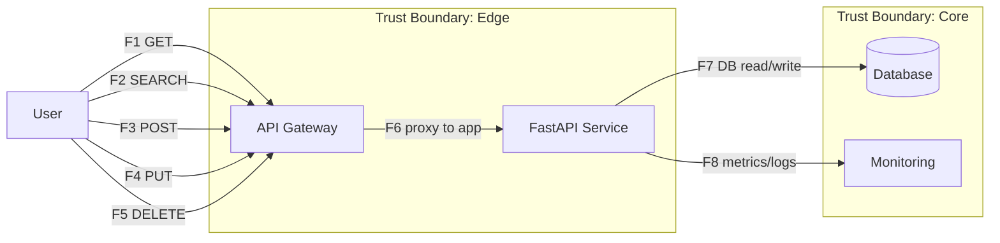

# DFD — Threat model (меревая диаграмма в Mermaid)

**Описание:** DFD уровня «контекст + логика + хранение данных» для сервиса Wishlist (FastAPI). Отмечены границы доверия, внешние участники, хранилища, протоколы и пронумерованы потоки F1…F8.

F1..F5 : client API flows

F6 : proxy / edge to service

F7 : service to storage

F8 : telemetry flows
